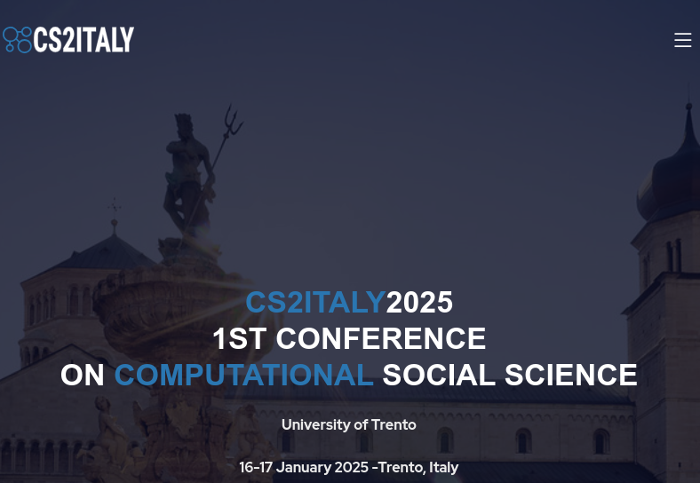

# cs2italy
repository of the cs2italy conference website - [https://github.io/cs2italy/conference](https://cs2italy.github.io/conference/) <br/>

# organization of the content
the site is created with jekyll technology and published as GitHub page
The directory that contains everything is [docs]()<Br/>
note: the screenshots here can change during the creation of the website

## basic information
in the file [_config.yml](docs/_config.yml) you can define some basic information like 
```yaml
title: CS2Italy 
description: >- # this means to ignore newlines until "baseurl:"
  Join the premier CS2 Italy Conference, a pivotal event for computational social scientists in Italy and internationally. Scheduled for 2025, this conference will feature interdisciplinary collaboration among experts in economics, sociology, psychology, and more. Expect in-depth discussions, innovative research, and the launch of the Society Computational Social Science Italy (CS2 Italy), a new association for scholars in the field
keywords: conference, cs2italy, computational social science, trento, italy, fbk
year: 2025
datelocation: 16-17 January 2025 -Trento, Italy
organizers: University of Trento
```
  
most are visibile on the landing page<br/>

## texts
In the directory [_texts](_texts) there are markdown structured files.
* [01_about.md](docs/_texts/01_about.md) contains the description of the main website<br/>
* [02_topics.md](docs/_texts/02_topics.md) contains the description of the topics of the conference<br/>
* [03_dates.md](docs/_texts/03_dates.md) contains the dates of the conference<br/>
* [04_registrationfees.md](docs/_texts/04_registrationfees.md) contains the description of the fees for the registration
* [05_sponsors.md](docs/_texts/05_sponsors.md) contains the information for the sponsors

## tables
The directory [_data](_data) contains tabular files (csv) to store information to show as tables (es. program, speakers ...)<br/>
The order of the list is based on the same order present in the csv file (actualy in alphabetic order from the first column)

* [organizers.csv](docs/_data/organizers.csv) there is the list of the organizers
* [scientific_committee.csv](docs/_data/scientific_committee.csv) the list of the members of the scientific committee
* [program_day1.csv](docs/_data/program_day1.csv) the schedule of the day 1
* [program_day2.csv](docs/_data/program_day2.csv) the schedule of the day 2
* [program_day3.csv](docs/_data/program_day3.csv) the schedule of the day 3
* [program_day4.csv](docs/_data/program_day4.csv) the schedule of the day 4
* [sponsors.csv](docs/_data/sponsors.csv) the list of the sponsors


## images
The images are stored in the directory [img/](docs/assets/img) under the directory [docs/assets](assets).<br/>
- [docs/img/assets/](supporters)<br/>the logos of the sponsors.
- [docs/img/gallery](gallery)<br/>the images used for the venue section
